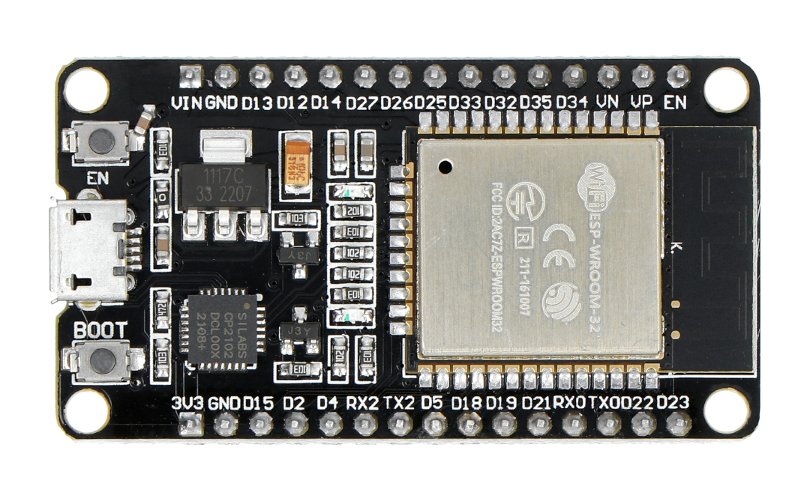

# Appendices: Hardware Specifications

This appendix lists the hardware specifications of the ESP32 boards and related components used in CSI data collection and experimentation.

---

## 1. ESP32 Development Board

### Model Used
- ESP32-WROOM-32 DevKit V1

### Key Features
| Specification         | Value                             |
|----------------------|------------------------------------|
| SoC                  | ESP32-D0WDQ6                       |
| CPU Cores            | Dual-core Tensilica Xtensa LX6     |
| Clock Speed          | Up to 240 MHz                      |
| RAM                  | 520 KB SRAM                        |
| Flash Memory         | 4 MB (varies by board)             |
| Wi-Fi                | 802.11 b/g/n/e/i                   |
| Bluetooth            | v4.2 BR/EDR and BLE                |
| UART                 | 3 UART interfaces                  |
| Operating Voltage    | 3.3 V                              |
| USB to Serial Chip   | CP2102 or CH340                    |

### Notes
- Ensure the board supports UART at ≥ 921600 baud for stable CSI output
- Most DevKit V1 boards come with CP2102 serial chip, which is reliable

---

## 2. Optional Components

| Component             | Purpose                          |
|----------------------|----------------------------------|
| Micro-USB Cable       | For power and serial interface   |
| SD Card Module        | Local CSI data logging (if used) |
| Tripod Stand          | For stable sensor placement      |
| Breadboard & Wires    | For prototyping if required      |

---

## 3. Photos

- **ESP32-WROOM DevKit (Top View)**

- **Complete CSI Logging Setup**
  

---

## Summary

Refer to the **Hardware Requirements** section for the initial setup, procurement checklist, and environment considerations. This appendix provides deeper technical specifications to complement that setup.

Understanding the ESP32 hardware specifications is essential to ensure proper configuration, stable UART communication, and reliable CSI data collection. Consistent and known hardware also ensures repeatability across experiments.

