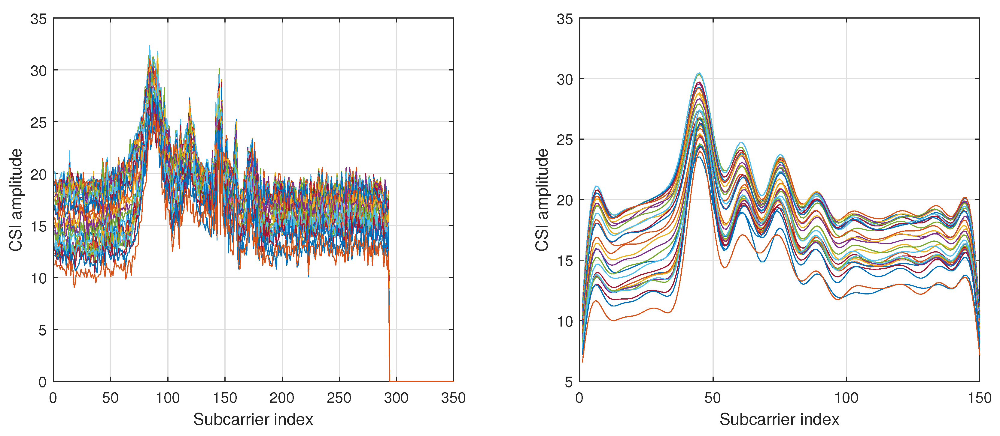
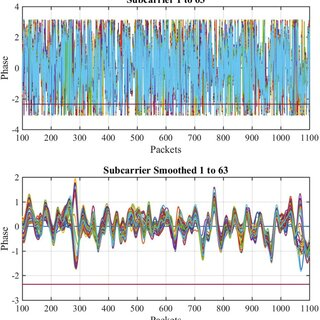

# Data Analysis: Plotting and Visualization

This section describes how to visualize CSI data collected from the ESP32-CSI Tool to extract meaningful patterns, trends, and signal behaviors.

---

## 1. Tools Required

Before plotting, ensure the following Python packages are installed:

```bash
pip install numpy matplotlib pandas
```

You may also use Jupyter Notebook for interactive analysis:

```bash
pip install notebook
jupyter notebook
```

---

## 2. Data Preparation

Typically, CSI data is logged in a `.csv` file using `idf.py monitor | grep "CSI_DATA" > csi_output.csv` or with a timestamped script.

Ensure your CSV file has rows formatted like:

```
Timestamp, MAC, RSSI, CSI_Length, I1,Q1, I2,Q2, ..., In,Qn
```

Use `serial_to_dataframe.py` from the ESP32-CSI-Tool `python_utils/` directory to convert raw serial logs into a structured DataFrame.

---

## 3. Plotting Amplitude per Subcarrier

```python
import pandas as pd
import numpy as np
import matplotlib.pyplot as plt

# Load structured CSV
df = pd.read_csv("csi_output.csv")

# Extract I/Q values and compute amplitude
num_subcarriers = 52
for index, row in df.iterrows():
    iq_pairs = np.array(row[4:4+2*num_subcarriers]).astype(int)
    i_vals = iq_pairs[0::2]
    q_vals = iq_pairs[1::2]
    amplitude = np.sqrt(i_vals**2 + q_vals**2)

    plt.plot(range(len(amplitude)), amplitude, label=f"Packet {index}")
    if index == 10:  # limit to first 10 plots for clarity
        break

plt.title("CSI Amplitude across Subcarriers")
plt.xlabel("Subcarrier Index")
plt.ylabel("Amplitude")
plt.grid(True)
plt.show()
```

---

## 4. Live Visualization (Optional)

The ESP32-CSI Tool includes `serial_plot_csi_live.py` for real-time plotting:

```bash
python python_utils/serial_plot_csi_live.py
```

You can also modify it to highlight specific subcarriers or track phase over time.

---

## 5. Visualizing Phase

After unwrapping and filtering phase data, you can visualize relative movement or Doppler shifts.

```python
phase = np.arctan2(q_vals, i_vals)
plt.plot(range(len(phase)), phase)
plt.title("Phase per Subcarrier")
plt.xlabel("Subcarrier Index")
plt.ylabel("Phase (radians)")
plt.grid(True)
plt.show()
```

---

## 6. Sample Visualization Outputs

Below are examples of how CSI data might look when plotted:

### Amplitude vs packets (Single Frame):


### Phase vs packets (Single Frame):


These visualizations are helpful in analyzing:
- Multipath fading and signal distortion
- Breathing waveforms (in phase plots over time)
- Signal stability across static environments

## Summary

CSI visualization is essential for interpreting signal characteristics. Start with amplitude plots to observe motion or environment changes, and explore phase to understand fine-grained effects like respiration or Doppler shifts.

