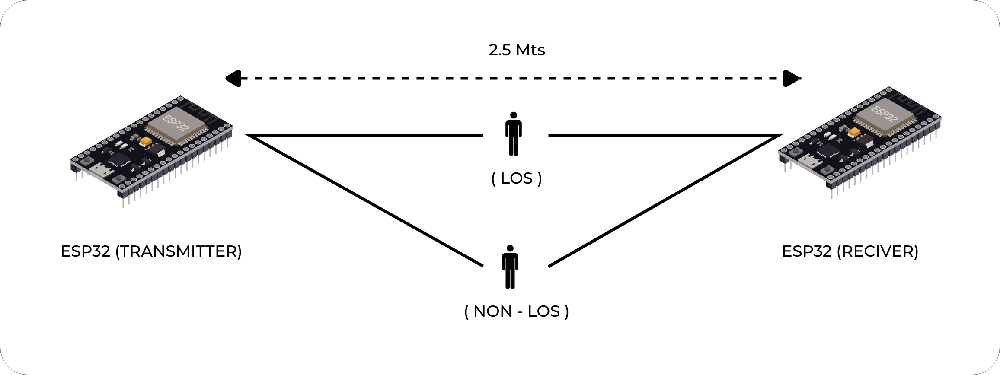

# Data Collection Setup

This section describes how to physically set up your environment and ESP32 devices to reliably collect CSI data using the ESP32-CSI Tool. A consistent and controlled layout is essential for meaningful CSI analysis.

---

## Physical Layout

The quality and consistency of CSI data depends heavily on the physical layout of the devices and the test environment. This includes the placement of the transmitter (TX), receiver (RX), the surrounding space, and sources of interference.

### Recommended Setup

- Use at least **two ESP32 boards**:
  - One as a transmitter (TX) (e.g., in `active_sta` mode)
  - One as a receiver (RX) (e.g., in `passive` or `active_ap` mode)
- Place devices on **non-metallic, stable surfaces** to minimize signal reflections
- Test both **line-of-sight (LoS)** and **non-line-of-sight (NLoS)** scenarios between TX and RX depending on the use case
- Keep **TX and RX at the same height**, preferably above the floor (e.g., on tripods)
- Ensure the **room has minimal external interference** (e.g., avoid routers and microwaves nearby)

### Example Room Setup

- Room Size: 4 m x 4 m
- TX to RX Distance: 1.5 m to 3 m (depending on experiment)
- Wall materials and furniture should be documented for repeatability
- External people or moving objects should be minimized during data capture

### Example Layout Diagram

```
[TX Node]  ---> 1.5m–3m --->  [RX Node connected to logging PC]
```

### Example Setup Photos

Below are representative images of physical data collection setups.

- **LoS and NLoS etup with tripod-mounted ESP32 boards**:



Ensure similar arrangement when replicating experiments. Use printed tape markers or floor guides to maintain repeatable distances and orientation.

Place a printed measuring tape or use a grid floor plan to maintain consistent placements between runs.

### Mounting Guidelines

- Use tripods or adhesive mounts for fixing ESP32 boards
- Boards should face each other in parallel if testing direct line-of-sight
- Use consistent orientations for all tests (same board side facing target)

### Environmental Notes

- Record environmental conditions: time of day, lighting, temperature (if relevant)
- Mark any moving sources (fans, doors, etc.)
- Keep the test area controlled and repeatable

---

## Summary

A stable and repeatable physical setup is critical for high-quality CSI data collection. Ensure consistent TX-RX distance, minimize interference, and document environmental conditions for every test session.

