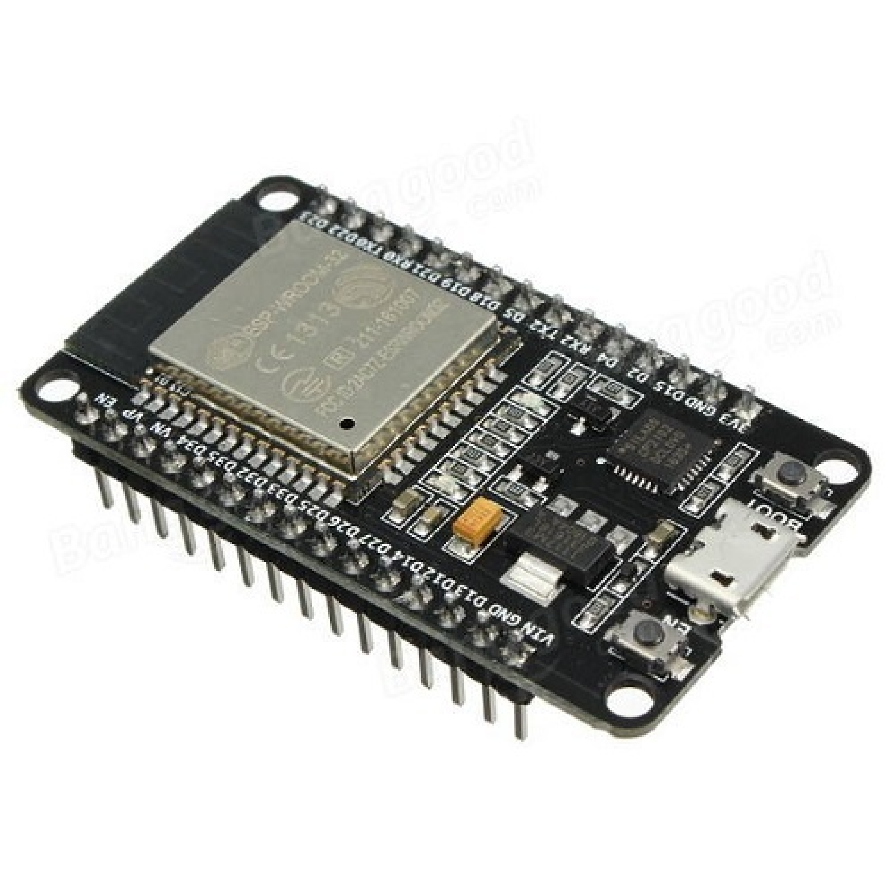
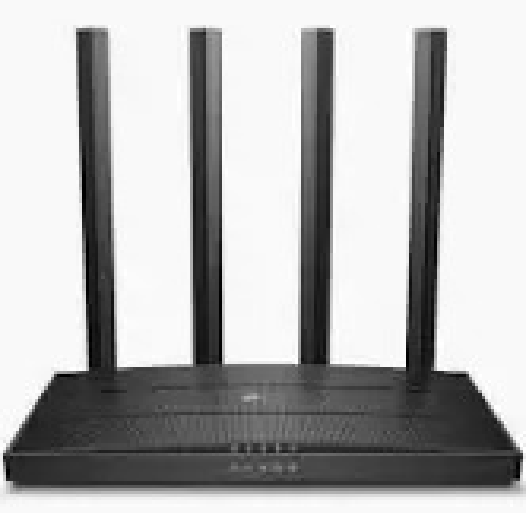
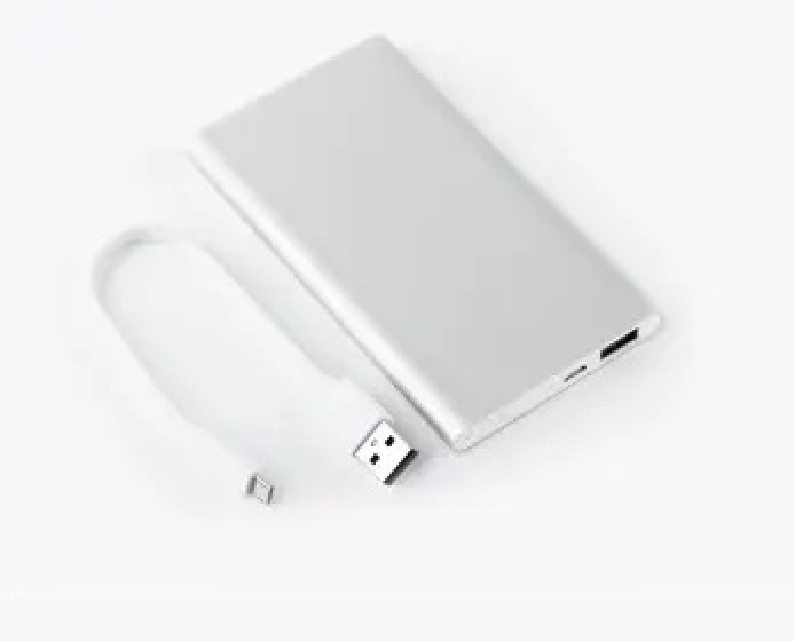
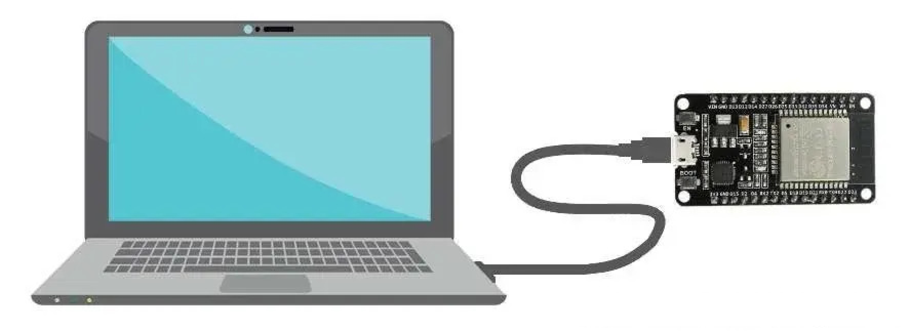

# Hardware Requirements

This section provides a comprehensive list of the hardware components required to set up and run the ESP32-CSI Tool. The setup described here has been validated by the embedded team at Rayiot Solutions Inc. and ensures stable CSI data capture under various test conditions.

---

## 1. ESP32 Development Board

We use the **ESP32-WROOM-32 DevKit v1** for all CSI-related experiments. The firmware provided by the ESP32-CSI Tool is compatible with this board, and it provides UART connectivity for reliable data transmission to the host PC.

### Specifications:
- Microcontroller: Tensilica Xtensa LX6 (dual-core, 240 MHz)
- Flash: 4 MB
- RAM: 520 KB SRAM
- Wi-Fi: IEEE 802.11 b/g/n
- UART, SPI, I2C, ADC interfaces
- USB-to-UART bridge onboard (CP2102 or CH340)

### ESP32 DevKit v1:

### Notes:
- Ensure the board is **genuine or from a trusted vendor** to avoid UART instability.
- Boards with CP2102 USB chips tend to offer better serial stability.

---

## 2. USB Cable (Micro-USB)

A standard **USB-A to Micro-USB** cable is used to connect the ESP32 board to the host system. This serves both as a power supply and UART communication interface.

### Notes:
- Use a **data-capable cable** (not just a charging cable).
- Cable length should be limited to **under 1.5 meters** for stability.

### Image:

---

## 3. Host Machine (Laptop or PC)

The host machine is used for:
- Flashing firmware
- Monitoring UART output
- Parsing and storing CSI data

### Minimum Requirements:
- OS: Windows 10, Linux (Ubuntu 20.04+ recommended), or macOS
- RAM: 4 GB or more
- Python 3.8+
- At least 1 free USB port

---

## 4. Wi-Fi Router or Access Point

An 802.11 b/g/n compatible router is required to generate Wi-Fi traffic for CSI collection. The ESP32 listens to these packets in monitor mode.

### Guidelines:
- 2.4 GHz only (ESP32 does not support 5 GHz)
- Place ESP32 boards within **2–4 meters** of the access point during experiments
- Ensure the network is lightly loaded to avoid interference

### Image:

---

## 5. Power Supply (Optional)

If the USB port is not used for power, or if conducting mobile experiments (e.g., from a battery):

### Recommended:
- 5V, 2A portable **power bank**
- USB breakout board with external power supply
- Li-ion battery with voltage regulator (for compact embedded systems)

### Image:

---

## 6. Physical Mounts and Fixtures

To ensure reproducibility and reduce signal artifacts caused by board movement:

### Used:
- Tripod stands or custom 3D-printed holders
- Double-sided tape or rubber pads for fixed placement
- Ruler/tape measure for documenting layout distance between devices

### Image:

---

## 7. Optional Accessories

| Item                 | Purpose                                             |
|----------------------|-----------------------------------------------------|
| External Antennas    | For improved signal strength and directionality     |
| Heat sinks           | Prevent overheating during long test sessions       |
| Breadboards          | For clean prototyping in multipoint sensing setups  |
| EMI shields          | For signal isolation in noisy environments          |

## 8. Hardware Procurement Checklist

Below is the recommended list of hardware components needed for setting up the ESP32-CSI Tool environment. This list can be used for procurement, budgeting, or internal tracking.

| Item                  | Quantity | Specification / Model           | Preferred Vendor          | Approx. Cost (INR) | Notes                          |
|-----------------------|----------|----------------------------------|----------------------------|--------------------|--------------------------------|
| ESP32 DevKit v1       | 2        | ESP32-WROOM-32, CP2102/CH340     | Mouser, Robu.in            | 350 – 500          | Minimum 2 units for TX/RX     |
| USB-A to Micro-USB    | 2        | Data-capable, <1.5 m length      | Amazon, local electronics  | 50 – 100           | Must support power + UART     |
| Wi-Fi Router          | 1        | 2.4 GHz, 802.11 b/g/n            | TP-Link, D-Link            | 1000 – 1500        | Basic router sufficient       |
| Power Bank            | 1        | 5V / 2A, 5000–10000 mAh          | Mi, Realme, Ambrane        | 600 – 1200         | Optional – for mobile tests   |
| Tripod/Stand          | 2        | Adjustable / table mount         | Amazon                     | 300 – 500          | For stable sensor placement   |
| External Antenna      | Optional | SMA Antenna (if board supports)  | Robu.in, AliExpress        | 200 – 400          | Needed for WROVER or IPEX     |
| Breadboard            | Optional | Full-size or mini                | Local electronics          | 100                | Useful for compact setup      |
| Heat Sinks            | Optional | Adhesive copper/aluminum         | Amazon, Robu.in            | 100 – 200          | For long-duration testing     |

**Download as CSV:** [Hardware Procurement Checklist (CSV)](../procurements/esp32_csi_hardware_procurement_checklist.csv)

---

## Summary

The hardware listed above is sufficient to fully deploy and evaluate the ESP32-CSI Tool in a variety of environments — ranging from lab setups to field trials. Proper handling an
